# Control and Trajectory Tracking for Autonomous Vehicle

# Proportional-Integral-Derivative (PID)

In this project, you will apply the skills you have acquired in this course to design a PID controller to perform vehicle trajectory tracking. Given a trajectory as an array of locations, and a simulation environment, you will design and code a PID controller and test its efficiency on the CARLA simulator used in the industry.

# Answers
### First run didn't end great
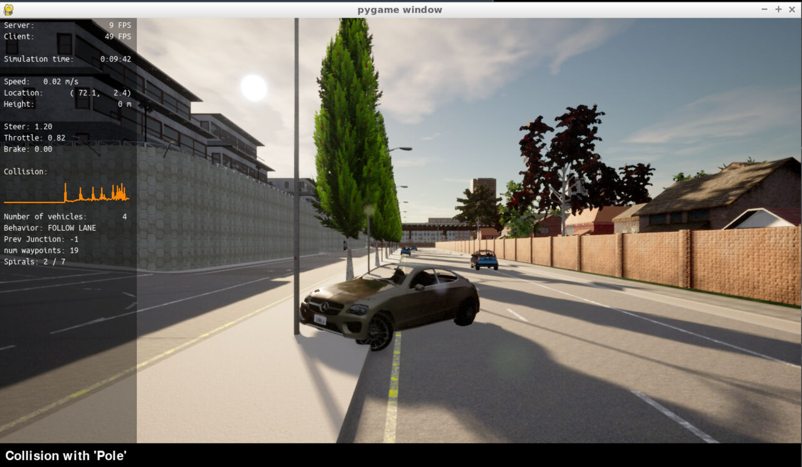
### Last run was a success
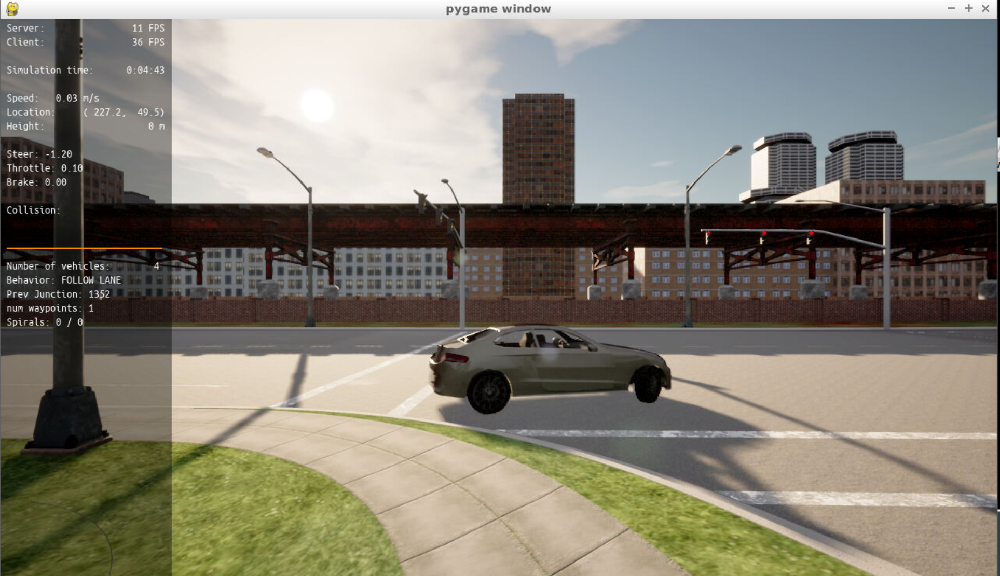

## Plots from PID tuning
### Steering
| Run | Steer params | Plot|
|-----|--------------|-----|
| 1 | P: 1.0, I: 1.0, D: 1.0| 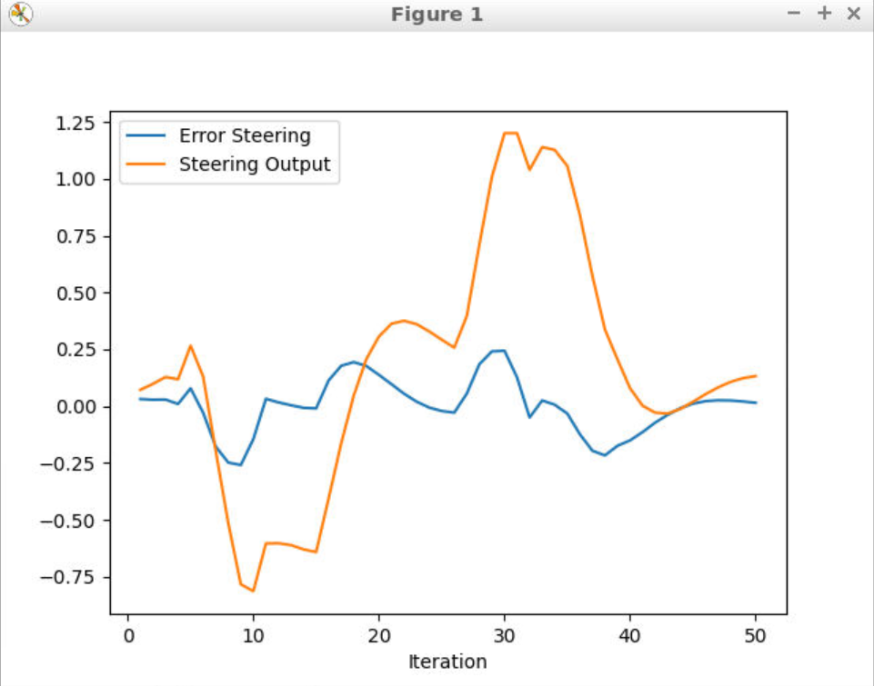|
| 2 | P: 0.5, I: 0.5, D: 1.0|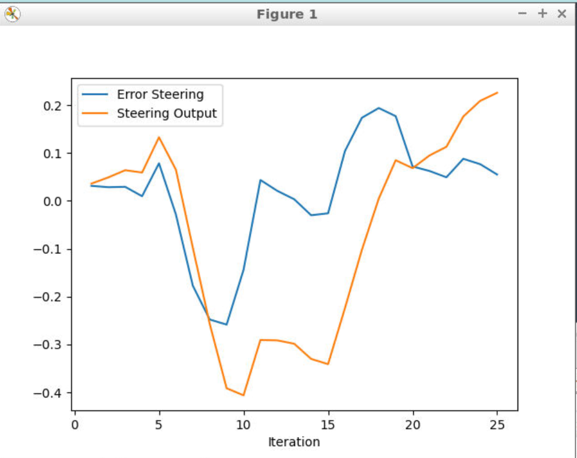 |
| 3 | P: 0.1, I: 0.05, D: 1.0|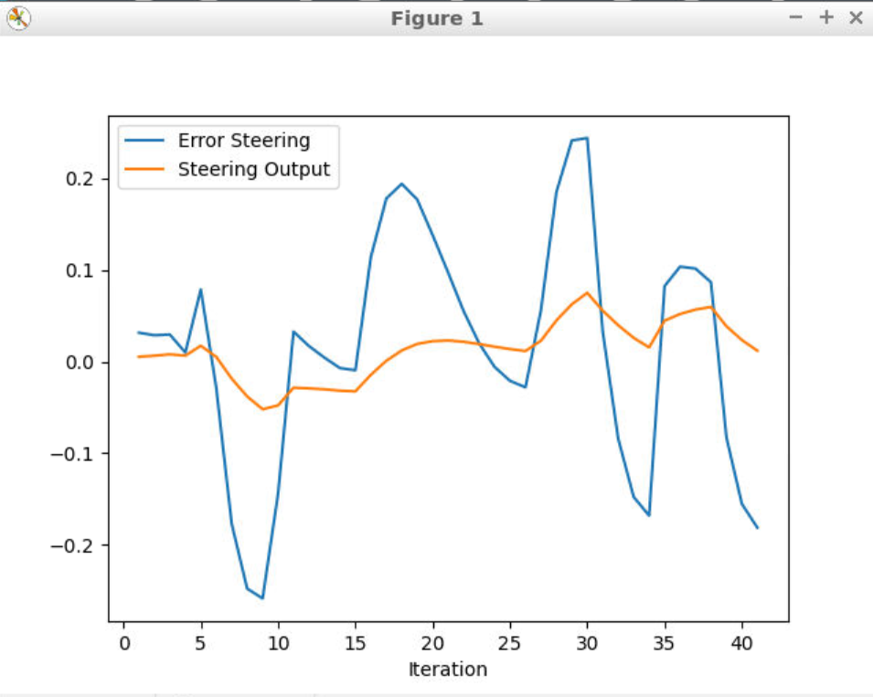 |
| 4 | P: 0.4, I: 0.005, D: 0.4|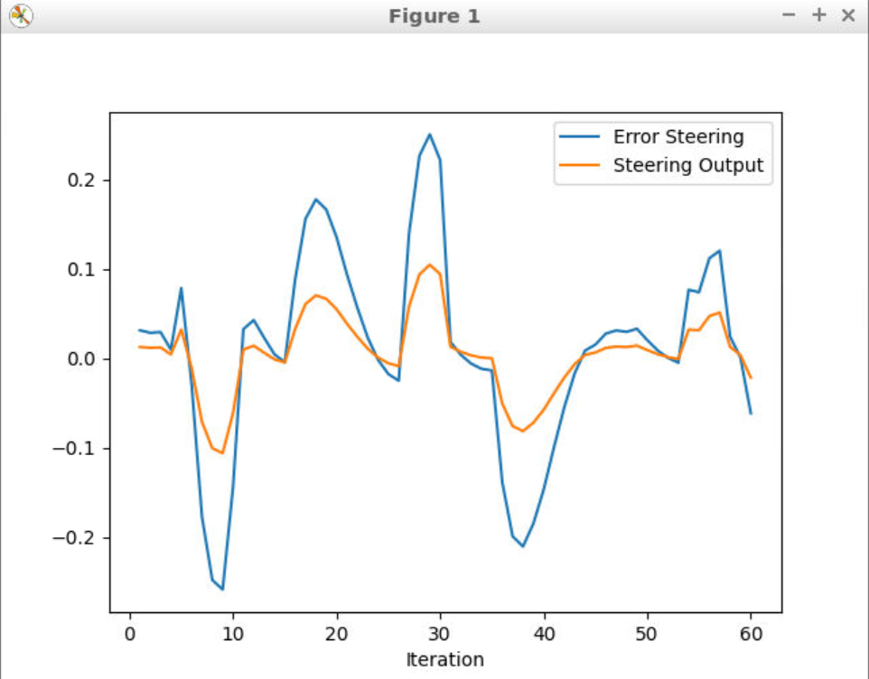 |
| 5 | P: 0.4, I: 0.001, D: 0.3|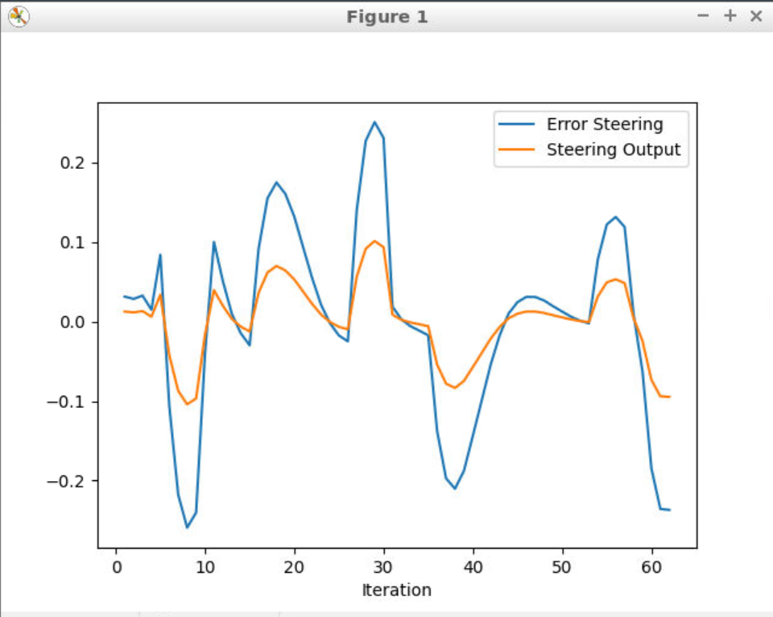 |

The steering error started off quite drastic and overshooting a lot. During the course of the PID tuning the error scale decreased a lot and the results were stable. 

### Steer data:
| Iteration | Error Steering | Steering Output|
| --------- | -------------- | ---------------|
| 1 | 0.031441 | 0.012617 |
| 2 | 0.028655 | 0.011531 |
| 3 | 0.029428 | 0.011870 |
| 4 | 0.009841 | 0.004045 |
| 5 | 0.078524 | 0.031597 |

### Throttle
| Run | Throttle params | Plot|
|-----|-----------------|-----|
| 1 | P: 0.2, I: 0.004, D: 3.0|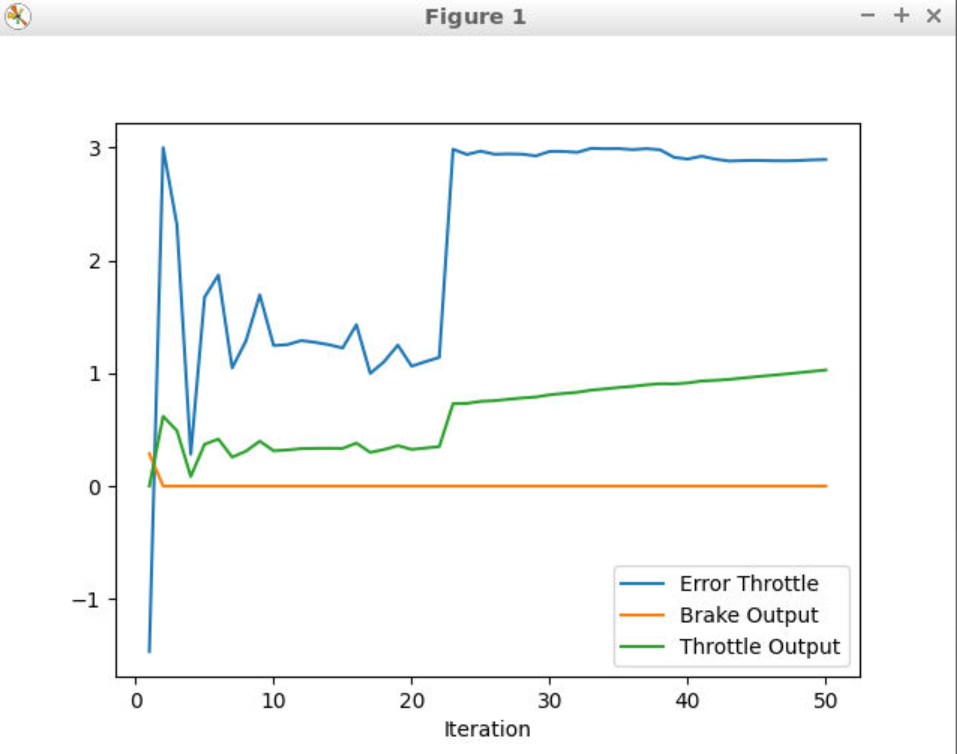 |
| 2 | P: 0.2, I: 0.01, D: 3.0|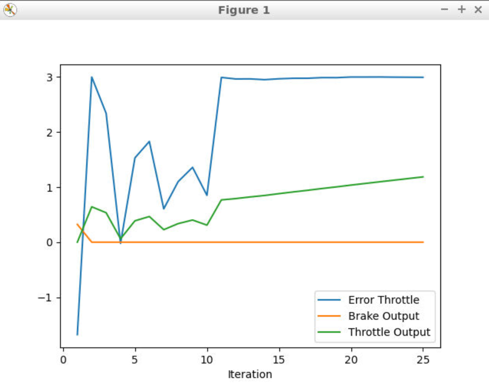 |
| 3 | P: 0.2, I: 0.01, D: 1.0|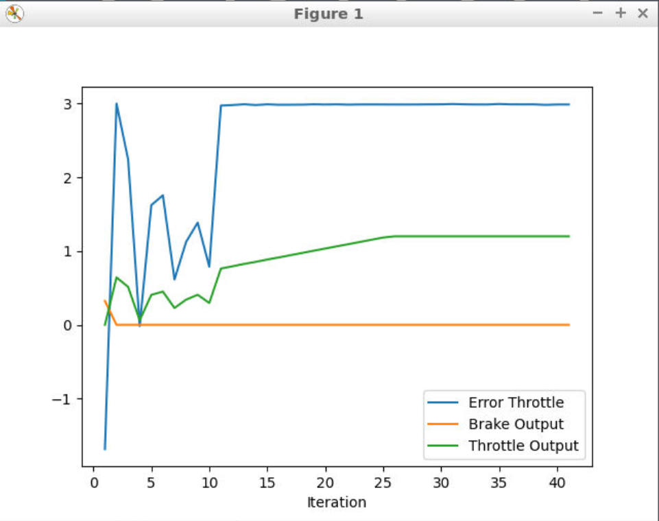 |
| 4 | P: 0.2, I: 0.001, D: 0.4|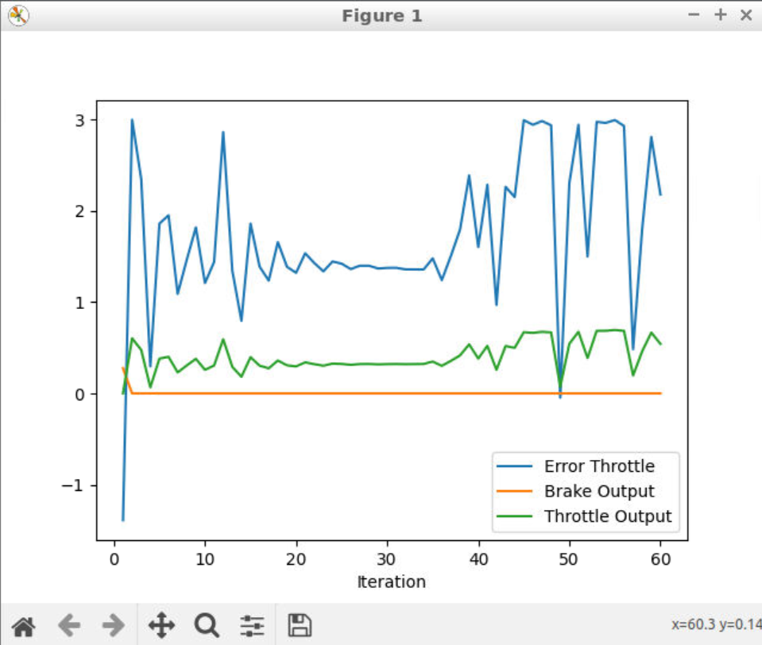 |
| 5 | P: 0.2, I: 0.001, D: 0.1|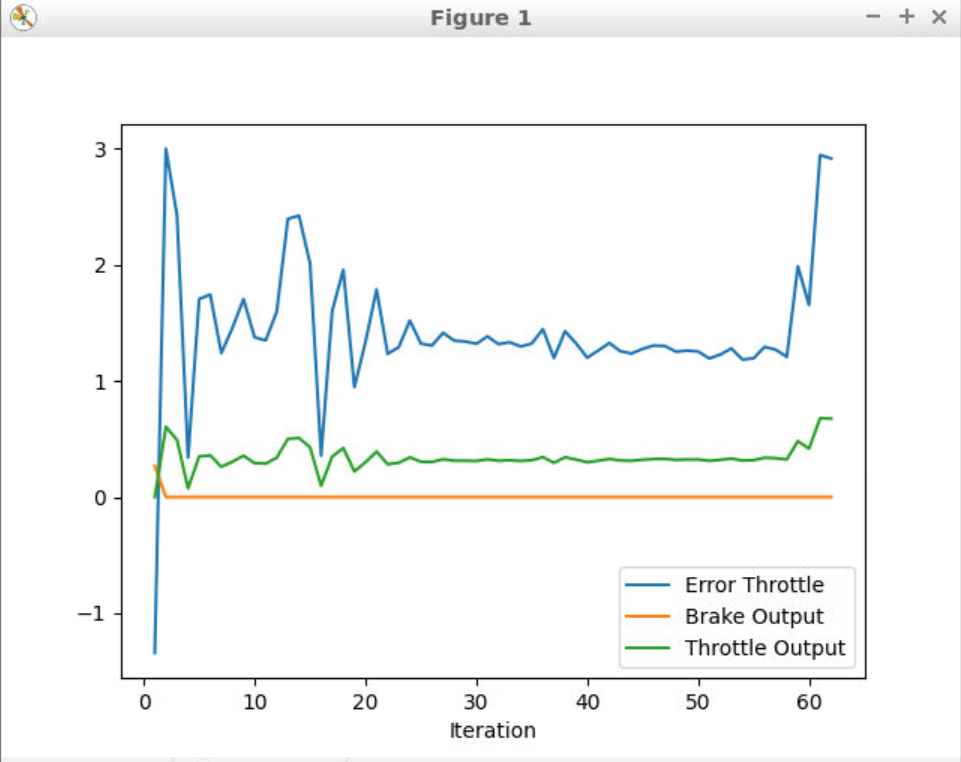 |

Throttle was initially showing a large bias and got stuck in a steady state. As result of the PID tuning the error level was more balanced and showcased some dynamic results.

### Throttle data:
| Iteration | Error Steering | Brake Output| Throttle Output|
| --------- | -------------- | ------------| ---------------|
| 1 | 1.360700 | 0.012617 | 0.270502 | 0.000000 |
| 2 | 2.998980 | 0.011531 | 0.000000 | 0.604433 |
| 3 | 2.399110 | 0.011870 | 0.000000 | 0.486860 |
| 4 | 0.304922 | 0.004045 | 0.000000 | 0.068327 |
| 5 | 1.798890 | 0.031597 | 0.000000 | 0.368920 |

## Answer the following questions:

**Q: What is the effect of the PID according to the plots, how each part of the PID affects the control command?**

A:
- P: Proportional term generate an output value that is proportional to the error value. High P gains can help reduce steady-state errors by quickening the response.

- I: Integral term takes into account the accumulated error over time. Integral of the error is contributed to the control command, and this help alleviate steady-state errors and decreases error accumulation over time.

- D: Derivative term help predict future behavior by contributing to the control command based on the rate of change. It provides stability and helps dampen overshoots and oscillations by anticipating future trends and adjusting accordingly.

**Q: How would you design a way to automatically tune the PID parameters?**

A: The *Twiddle* optimization algorithm shown in the lectures could be beneficial to tuning the PID values. It iteratively adjusts the values and checks the performance of the controller between each adjustment for direction. It will eventually arrive at optimal values.   

**Q: PID controller is a model free controller, i.e. it does not use a model of the car. Could you explain the pros and cons of this type of controller?**

A: Pros
- More simple, less "moving parts" equals to less possible bugs and easier to tweak
- More general, usable in more situations since it's not tied to a specific model

Cons: 
- Suboptimal performance, even if PID controller can give OK performance in some cases, it can not match the level of control a model would give
- Tuning, a PID system needs to be tuned by a time consuming process of trial and error while a model-based system can estimate parameters based on the model itself and optimize the controller using those   

**Q: (Optional) What would you do to improve the PID controller?**

A: Optimizing the parameter with an algorithm like Twiddle could be a good start. There are also other tools like *"Anti-Windup Mechanism"* to control overshooting or *"Feedforward Control"* which tries to predict the control signal to improve performance in addition to the feedback control from the PID.

