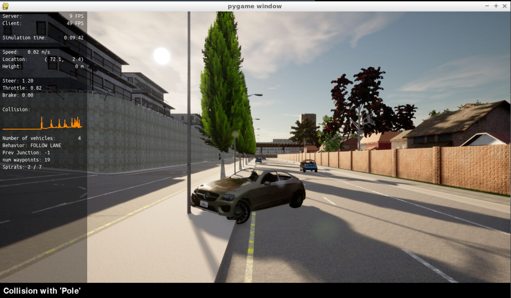
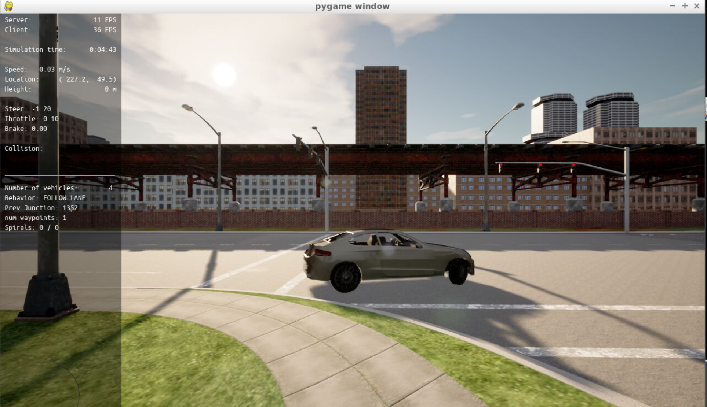
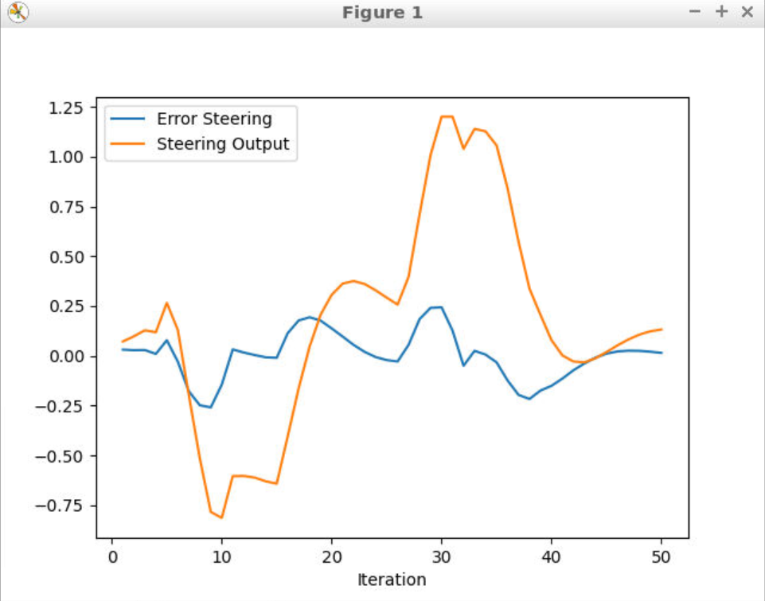
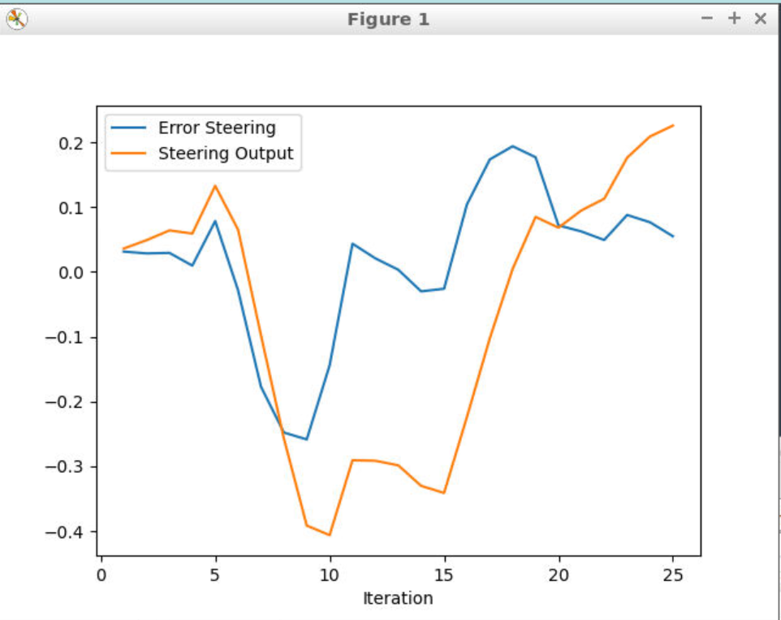
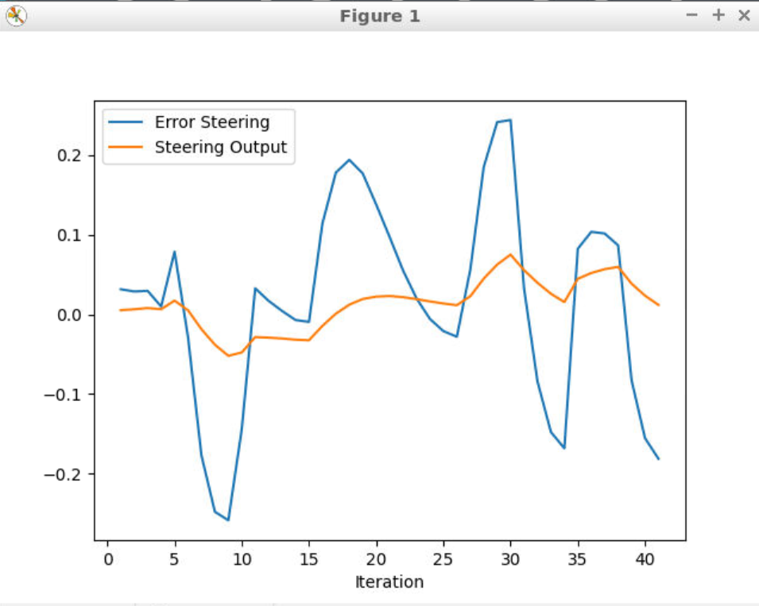
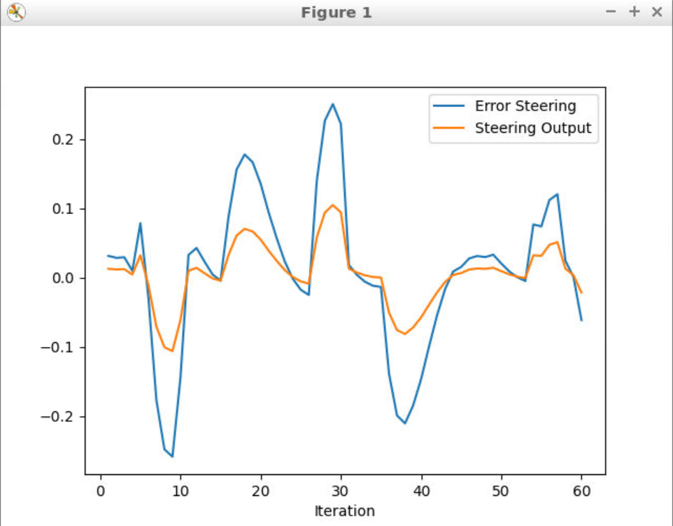
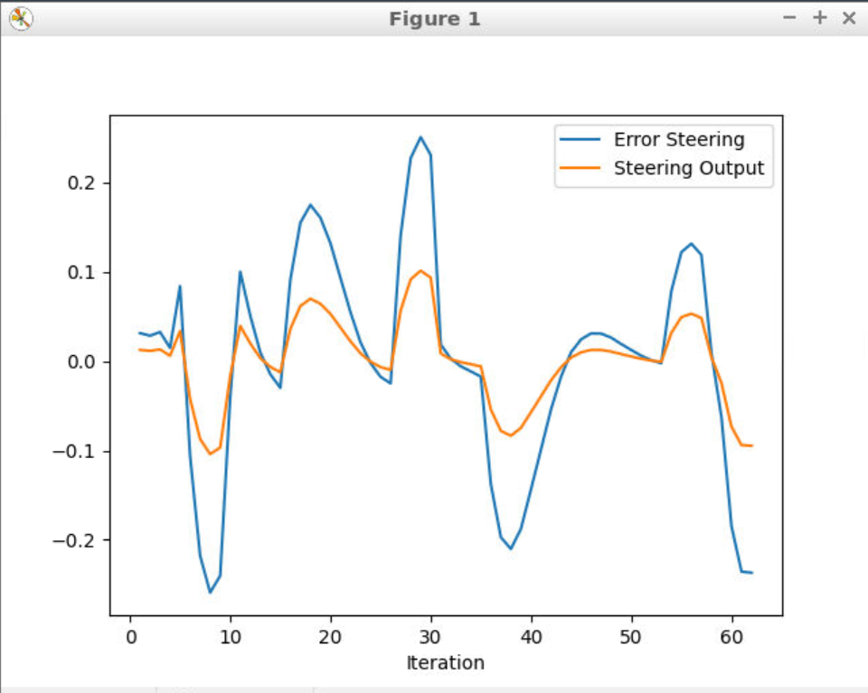

# Control and Trajectory Tracking for Autonomous Vehicle

# Proportional-Integral-Derivative (PID)

In this project, you will apply the skills you have acquired in this course to design a PID controller to perform vehicle trajectory tracking. Given a trajectory as an array of locations, and a simulation environment, you will design and code a PID controller and test its efficiency on the CARLA simulator used in the industry.

# Answers
### First run didn't end great

### Last run was a success

## Plots from PID tuning
### Steering
| Run | Steer params | Plot|
|-----|--------------|-----|
| 1 | P: 1.0, I: 1.0, D: 1.0| |
| 2 | P: 0.5, I: 0.5, D: 1.0| |
| 3 | P: 0.1, I: 0.05, D: 1.0| |
| 4 | P: 0.4, I: 0.005, D: 0.4| |
| 5 | P: 0.4, I: 0.001, D: 0.3| |

### Steer data:
| Iteration | Error Steering | Steering Output|
| --------- | -------------- | ---------------|
| 1 | 0.031441 | 0.012617 |
| 2 | 0.028655 | 0.011531 |
| 3 | 0.029428 | 0.011870 |
| 4 | 0.009841 | 0.004045 |
| 5 | 0.078524 | 0.031597 |

### Throttle
| Run | Throttle params | Plot|
|-----|-----------------|-----|
| 1 | P: 0.2 I: 0.004 D: 3.0| Plot|
| 2 | P: 0.2 I: 0.01 D: 3.0| Plot|
| 3 | P: 0.2 I: 0.01 D: 1.0| Plot|
| 4 | P: 0.2 I: 0.001 D: 0.4| Plot|
| 5 | P: 0.2 I: 0.001 D: 0.1| Plot|

### Throttle data:
| Iteration | Error Steering | Brake Output| Throttle Output|
| --------- | -------------- | ------------| ---------------|
| 1 | 1.360700 | 0.012617 | 0.270502 | 0.000000 |
| 2 | 2.998980 | 0.011531 | 0.000000 | 0.604433 |
| 3 | 2.399110 | 0.011870 | 0.000000 | 0.486860 |
| 4 | 0.304922 | 0.004045 | 0.000000 | 0.068327 |
| 5 | 1.798890 | 0.031597 | 0.000000 | 0.368920 |

Answer the following questions:
- Add the plots to your report and explain them (describe what you see)
- What is the effect of the PID according to the plots, how each part of the PID affects the control command?
- How would you design a way to automatically tune the PID parameters?
- PID controller is a model free controller, i.e. it does not use a model of the car. Could you explain the pros and cons of this type of controller?
- (Optional) What would you do to improve the PID controller?

